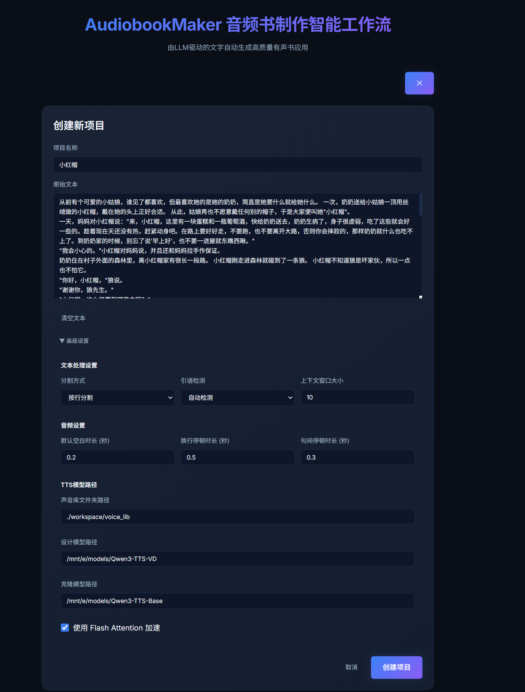
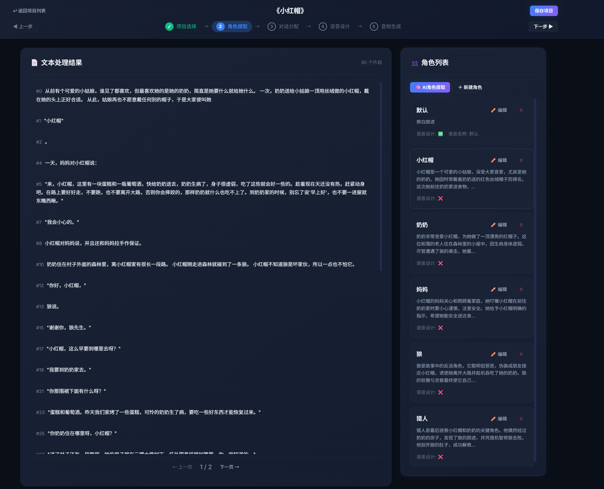
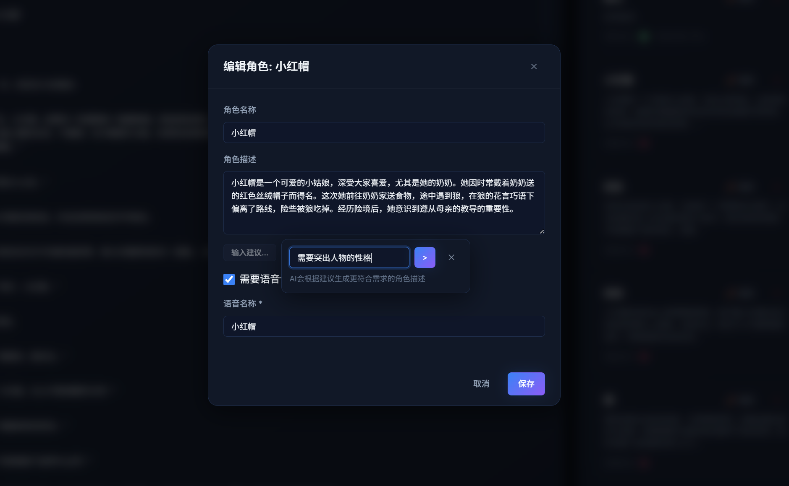
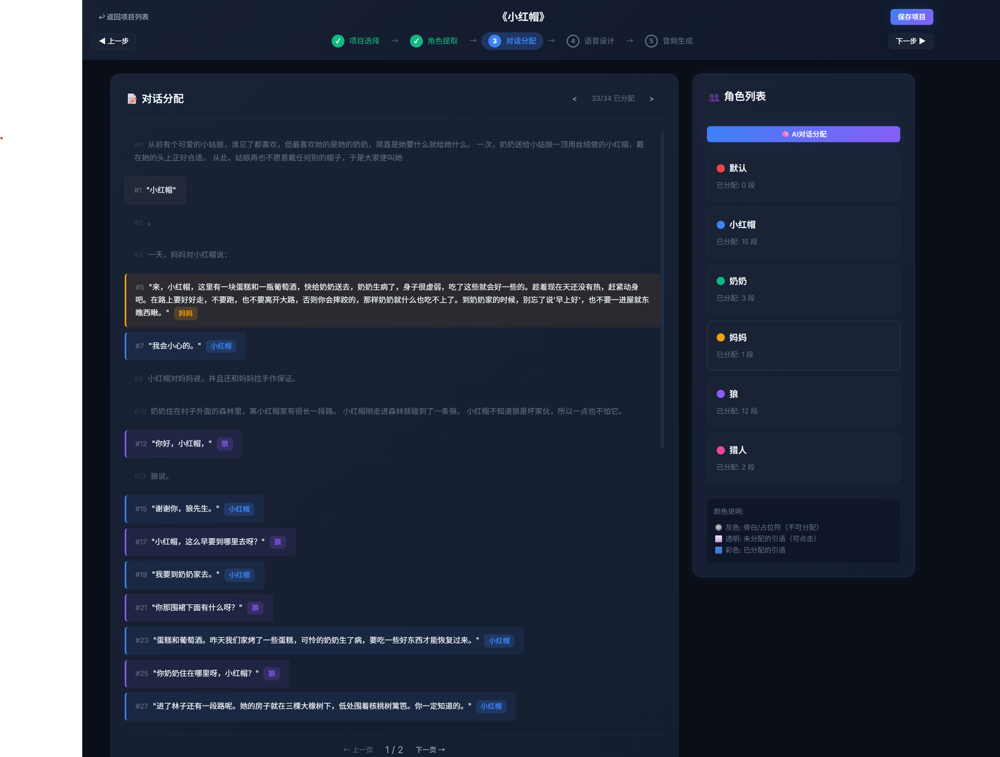
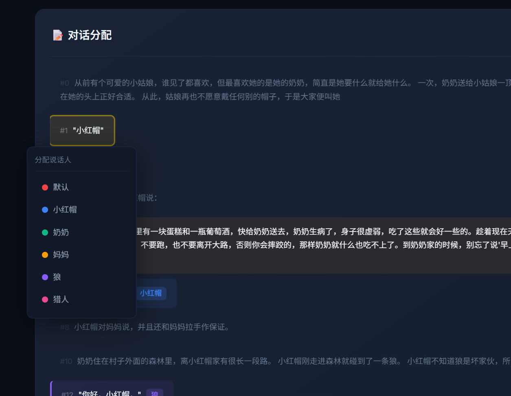
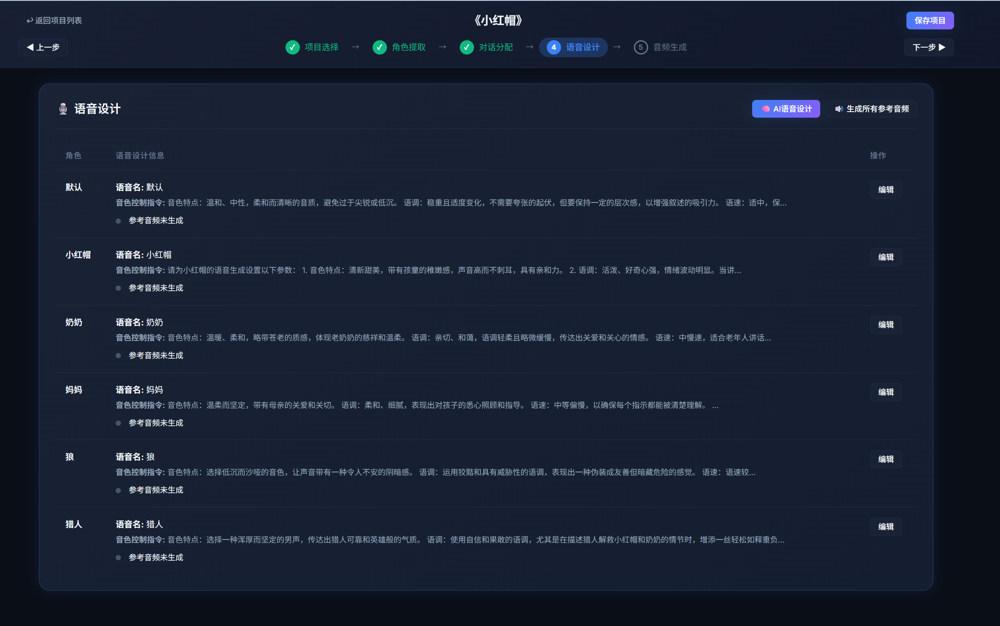
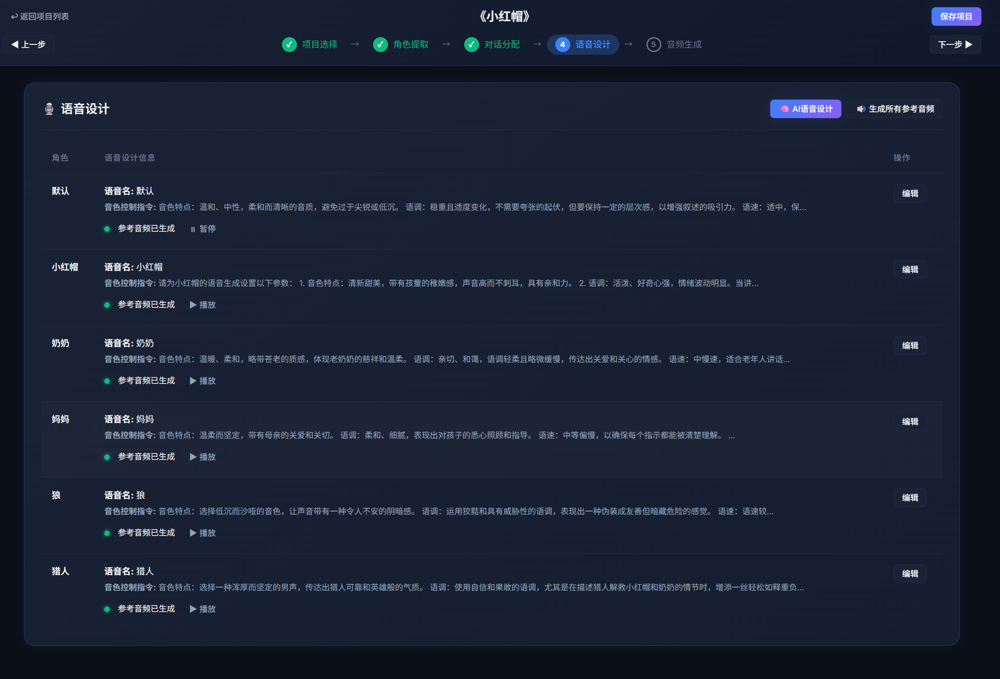
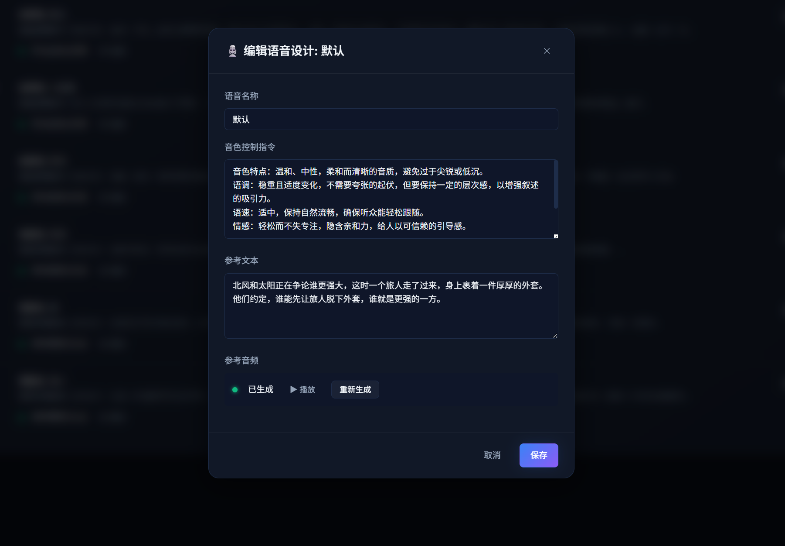
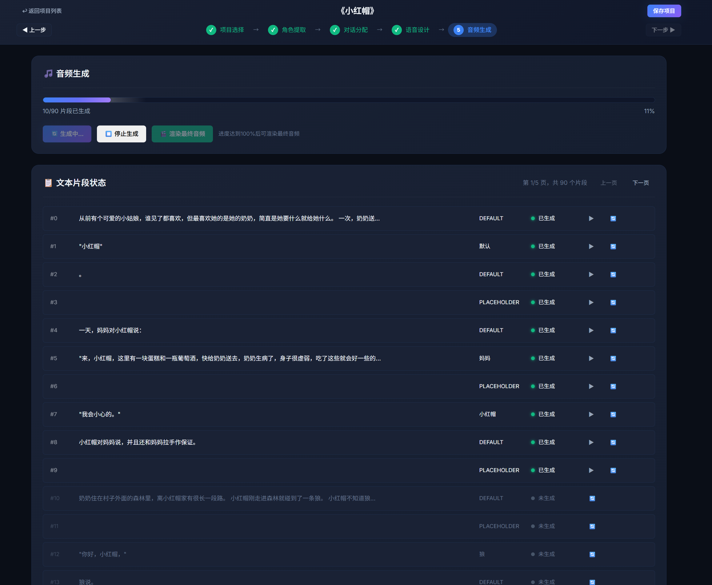
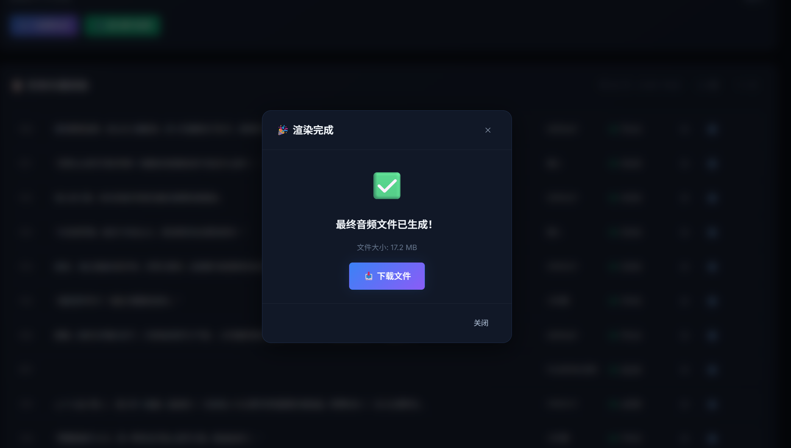

# AudiobookMaker - AI有声书制作工具

## 项目概述

AudiobookMaker 是一个基于AI的有声书制作工具，能够自动化处理文本到音频的转换流程。通过智能化的角色提取、对话分配、语音设计和音频合成能力，帮助用户快速、低成本（）制作高质量的有声书内容。


### 主要功能

- **角色提取**: AI自动分析文本提取角色信息和角色介绍，支持手动编辑
- **对话分配**: AI智能分配对话片段给相应角色，支持手动调整
- **语音设计**: AI根据角色介绍为每个角色设计独特的TTS风格控制指令
- **音频生成**: 使用TTS模型生成角色对话音频片段，并合并为最终的有声书成品


### 成本估算

使用如下配置和成本单价：
- Azure GPT-4o API 按输入$0.178/1M token，输出$0.174/1M token计
- Qwen3 TTS 由本地RTX4080S GPU部署，按$0.078/hr计

#### 示例项目：《小红帽》

原始文本长度：1747字

| 步骤 | 消耗 | 成本 |
|--------|------|--------|
| 人物提取 | 输入1660/输出461 (tokens) | $0.0006 |
| 对话分配 | 输入22174/输出103 (tokens) | $0.0404 |
| 音色设计 | 输入922/输出1032 (tokens) | $0.0009 |
| 参考语音 | 185 (seconds) | $0.0040 |
| 语音片段 | 660 (seconds) | $0.0143 |
| **总计** | | **$0.0602** |


综合单价为：$0.3446/万字


#### 真实生产级项目：某2027年即将出版的小说

（前三节）原始文本长度：10261字

| 步骤 | 消耗 | 成本 |
|--------|------|--------|
| 人物提取 | 输入8265/输出524 (tokens) | $0.0009 |
| 对话分配 | 输入80924/输出300 (tokens) | $0.1467 | 
| 音色设计 | 输入795/输出796 (tokens) | $0.0007 |
| 参考语音 | 219 (seconds) | $ |
| 语音片段 |  (seconds) | $ |
| **总计** | | **$** |


### 使用方法

AudiobookMaker 提供了一个直观的图形用户界面（Web GUI）来指导用户完成有声书制作的完整工作流。以下是根据界面截图展示的详细使用步骤：

#### 1. 创建项目

- 启动应用后，进入项目选择页面
- 点击"新建项目"按钮
- 输入项目名称和原始文本内容
- 点击"创建"按钮，系统会自动处理原始文本并分割为可管理的片段

#### 2. AI角色提取

- 进入角色提取页面（工作流步骤2）
- 点击"AI角色提取"按钮，系统将自动分析文本并识别主要角色
- 左侧显示处理后的文本分块
- 右侧显示提取的角色列表，包括角色名称和描述

#### 3. 手动调整角色

- 在角色列表中，可以：
  - 编辑角色名称和描述
  - 添加新角色（点击"新建角色"按钮）
  - 删除不需要的角色
  - 调整角色的TTS设置和语音名称
- 点击角色条目可展开详细编辑面板

#### 4. AI对话分配

- 进入对话分配页面（工作流步骤3）
- 点击"AI对话分配"按钮，系统将智能分析文本并自动将对话片段分配给相应角色
- 左侧文本中，已分配的片段会以对应角色的颜色高亮显示
- 不需要分配的叙述性文本显示为灰色

#### 5. 手动调整对话分配

- 点击任意文本片段可手动更改分配：
  - 弹出角色选择气泡菜单
  - 选择对应的角色或"无角色"（叙述文本）
  - 支持批量选择和分配
- 右侧显示角色列表和颜色标识，方便参考

#### 6. AI语音设计

- 进入语音设计页面（工作流步骤4）
- 点击"AI语音设计"按钮，系统将根据角色描述为每个角色生成独特的TTS风格控制指令
- 列表显示每个角色的语音设计详情：
  - 语音名称
  - TTS指令（控制语音风格、语调、语速等）
  - 参考文本

#### 7. AI参考音频生成

- 在语音设计页面，点击"生成参考音频"按钮
- 系统将为每个角色生成参考音频片段
- 生成后可以：
  - 播放参考音频进行试听
  - 重新生成不满意的音频
  - 下载参考音频文件

#### 8. 手动调整语音设计

- 点击任一语音设计条目可进行手动编辑：
  - 修改语音名称
  - 调整TTS指令以改变语音风格
  - 更新参考文本
  - 重新生成参考音频

#### 9. AI音频生成

- 进入音频生成页面（工作流步骤5）
- 点击"AI音频生成"按钮开始生成所有片段的音频
- 进度条显示整体生成进度
- 文本块根据生成状态变化颜色：
  - 灰色：已生成完成
  - 黑色：待生成或生成中
- 支持重新生成单个片段音频

#### 10. 最终渲染和下载

- 所有音频片段生成完成后，点击"最终渲染"按钮
- 系统将所有音频片段合并为完整的有声书文件
- 渲染完成后提供下载链接
- 可以播放完整有声书进行最终验收


### 技术栈

- **AI能力**: 兼容OpenAI API的角色提取、对话分配和语音设计，Qwen3 TTS语音合成
- **后端**: Python Flask
- **前端**: React, Vite, CSS


## 环境配置

### 系统要求

- Python 3.12
- Node.js 25.3.0

### 克隆项目
   ```bash
   git clone https://github.com/0-1CxH/AudiobookMaker.git
   cd AudiobookMaker
   ```

### 启动后端

1. **安装依赖**
   ```bash
   cd backend
   pip install -r requirements.txt
   ```

2. **配置环境变量**

   复制环境变量模板文件并配置：
   ```bash
   cp .env.example .env
   ```

   编辑 `.env` 文件，至少配置以下关键项：
   ```env
   # Flask配置
   FLASK_CONFIG=development
   FLASK_DEBUG=True
   FLASK_HOST=127.0.0.1
   FLASK_PORT=5000

   # LLM API配置（必需）
   LLM_API_KEY=your_openai_api_key_here
   LLM_API_URL=https://api.openai.com/v1
   LLM_MODEL=gpt-4

   # 项目路径配置
   WORKSPACE_PATH=./workspace

   # TTS模型配置（需要提前下载Qwen3-TTS模型: https://github.com/QwenLM/Qwen3-TTS/）
   TTS_DESIGN_MODEL_PATH=./workspace/design_model
   TTS_CLONE_MODEL_PATH=./workspace/clone_model
   ```

3. **启动Flask应用**
   ```bash
   python run.py
   ```

### 启动前端

1. **安装依赖**
   ```bash
   cd frontend
   npm install
   ```

2. **启动Vite开发服务器**
   ```bash
   npm run dev
   ```

   成功启动后，控制台将显示访问地址（默认为为 `http://localhost:5173`）

### 配置代理和CORS

前端已通过Vite配置代理，将 `/api` 请求转发到后端 `http://127.0.0.1:5000`。无需额外配置。

如果需要在不同端口运行，修改以下文件：

1. **后端端口**: 修改 `backend/.env` 中的 `FLASK_PORT`
2. **前端代理**: 修改 `frontend/vite.config.js` 中的 `target` 地址

### 环境变量说明

| 变量名 | 说明 | 默认值 |
|--------|------|--------|
| `FLASK_PORT` | 后端API端口 | 5000 |
| `FLASK_HOST` | 后端绑定地址 | 127.0.0.1 |
| `WORKSPACE_PATH` | 项目工作空间路径 | ./workspace |
| `LLM_API_URL` | OpenAI API URL | 必需 |
| `LLM_API_KEY` | OpenAI API密钥 | 必需 |
| `LLM_MODEL` | 使用的GPT模型 | 必需 |
| `TTS_DESIGN_MODEL_PATH` | TTS设计模型路径 | ./workspace/design_model |
| `TTS_CLONE_MODEL_PATH` | TTS克隆模型路径 | ./workspace/clone_model |

## 前端UI和UX设计

前端采用React构建，遵循模块化组件设计，提供直观的有声书制作工作流。

### 页面结构

1. **项目选择页面**
   - 显示所有已创建的项目列表
   - 支持创建新项目（输入项目名称和原始文本）
   - 加载现有项目进入工作流

2. **工作流导航栏**
   - 显示项目名称和当前步骤
   - 步骤指示器：1.项目选择 → 2.角色提取 → 3.对话分配 → 4.语音设计 → 5.音频生成
   - 当前步骤高亮显示（●），已完成步骤显示（✓），未完成步骤显示（○）
   - 支持上/下一步导航、返回项目列表、保存项目

3. **角色提取页面**
   - 左侧：处理后的文本分块显示
   - 右侧：角色列表，支持新建角色、AI角色提取
   - 角色编辑：可调整名称、描述、TTS设置、语音名称
   - AI生成角色描述功能

4. **对话分配页面**
   - 左侧文本中，不需要分配的segment置为灰色
   - 点击需要分配的segment进行手动分配（气泡选择）
   - AI对话分配：自动分配所有对话
   - 右侧显示角色列表和对应颜色标识

5. **语音设计页面**
   - 列表显示人物和对应的语音设计情况
   - AI语音设计按钮：自动生成所有语音设计
   - 手动编辑：编辑语音名、TTS指令、参考文本、参考音频
   - 参考音频：生成、播放参考音频

6. **音频生成页面**
   - 进度条显示生成进度
   - AI音频生成按钮：开始生成所有片段音频
   - 文本块显示生成状态（灰色已生成、黑色未生成）
   - 支持重新生成单个片段、播放片段音频
   - 最终渲染：生成完整的音频文件并下载

### 组件设计

- **App.jsx**: 主应用组件，管理页面导航和状态
- **ProjectList.jsx**: 项目列表组件
- **Navigation.jsx**: 工作流导航组件
- **CharacterExtract.jsx**: 角色提取组件
- **DialogueAssign.jsx**: 对话分配组件
- **VoiceDesign.jsx**: 语音设计组件
- **AudioGenerate.jsx**: 音频生成组件
- **SettingsModal.jsx**: 项目设置模态框
- **Toast.jsx**: 通知提示组件
- **api.js**: API接口封装

### 用户交互流程

```
项目选择 → 创建/加载项目 → 文本自动处理 → 角色提取 → 对话分配 → 语音设计 → 音频生成 → 最终渲染
```

每个步骤都支持AI自动处理和手动调整，确保用户有完全的控制权。

## 后端API设计

后端采用Flask框架，提供RESTful API接口，支持有声书制作的全流程。

### API架构

- **路由结构**: `/api/projects/{project_id}/{resource}/{action}`
- **响应格式**: 统一JSON响应，包含`success`, `message`, `data`字段
- **错误处理**: 标准错误响应，包含`error`和`error_type`字段
- **数据验证**: 使用Pydantic进行请求数据验证

### 核心API端点

#### 项目管理 (`/api/projects`)
- `GET /` - 获取项目列表
- `POST /` - 创建新项目
- `GET /{project_id}` - 获取项目详情
- `PUT /{project_id}` - 更新项目设置
- `DELETE /{project_id}` - 删除项目

#### 文本处理 (`/api/projects/{project_id}/text`)
- `GET /segments` - 获取文本片段
- `POST /process-text` - 处理原始文本

#### 角色管理 (`/api/projects/{project_id}/characters`)
- `GET /` - 获取角色列表
- `POST /` - 添加新角色
- `POST /extract` - AI提取角色
- `PUT /{character_name}` - 更新角色
- `DELETE /{character_name}` - 删除角色
- `POST /{character_name}/generate-description` - AI生成角色描述

#### 对话分配 (`/api/projects/{project_id}/dialogues`)
- `GET /` - 获取对话分配状态
- `POST /allocate` - AI分配对话
- `PUT /{segment_index}` - 手动更新对话分配

#### 语音设计 (`/api/projects/{project_id}/voice`)
- `GET /designs` - 获取语音设计列表
- `POST /generate-designs` - AI生成语音设计
- `PUT /designs/{voice_name}/update` - 更新语音设计
- `POST /generate-reference-audio` - 生成参考音频
- `GET /reference-audio/{voice_name}` - 获取参考音频文件

#### 音频生成 (`/api/projects/{project_id}/audio`)
- `POST /generate` - 开始生成音频（异步）
- `GET /status/{task_id}` - 获取生成状态
- `GET /segments` - 获取音频片段状态
- `POST /segments/{segment_index}/regenerate` - 重新生成单个片段
- `GET /progress` - 获取生成进度
- `POST /cancel/{task_id}` - 取消音频生成
- `GET /segments/{segment_index}/audio` - 获取片段音频文件

#### 输出渲染 (`/api/projects/{project_id}/output`)
- `POST /render` - 渲染最终音频文件
- `GET /status` - 获取渲染状态
- `GET /download` - 下载最终音频文件

### 数据模型

#### 项目结构
```
workspace/
├── projects/
│   └── {project_name}/
│       ├── project_metadata.json  # 项目元数据
│       ├── raw_text.txt           # 原始文本
│       └── voice_artifacts/       # 音频片段
```

#### 项目元数据示例
```json
{
  "name": "项目名称",
  "project_setting": {
    "split_format": "line",
    "quote_format": "auto",
    "context_window": 10,
    "voice_lib_folder_path": "./workspace/voice_lib",
    "design_model_path": "./workspace/design_model",
    "clone_model_path": "./workspace/clone_model",
    "use_flash_attention": false,
    "default_duration": 0.2,
    "line_break_duration": 0.5,
    "sentence_margin_duration": 0.3
  },
  "raw_text": "原始文本内容",
  "text_manager": {
    "data": [
      {"content": "文本片段1", "tag": "default"},
      {"content": "文本片段2", "tag": "character1"}
    ],
    "allocation_map": {"1": "character1"}
  },
  "character_manager": {
    "characters": [
      {
        "name": "角色名",
        "description": "角色描述",
        "requires_tts": true,
        "voice_name": "语音名称"
      }
    ]
  },
  "voice_manager": {
    "voice_designs": [
      {
        "name": "语音名称",
        "tts_instruction": "TTS指令",
        "reference_text": "参考文本",
        "reference_audio_path": "音频文件路径"
      }
    ]
  },
  "text_to_audio_segment_map": {
    "0": "片段音频路径"
  }
}
```


### 项目结构
```
AudiobookMaker/
├── backend/                 # 后端代码
│   ├── app/                # Flask应用
│   │   ├── api/            # API端点
│   │   ├── core/           # 核心逻辑
│   │   ├── models/         # 数据模型
│   │   └── config.py       # 配置管理
│   ├── requirements.txt    # Python依赖
│   ├── run.py             # 启动脚本
│   └── .env.example       # 环境变量模板
├── frontend/              # 前端代码
│   ├── src/               # React组件
│   │   ├── components/    # UI组件
│   │   ├── api.js         # API封装
│   │   └── App.jsx        # 主应用
│   ├── package.json       # Node.js依赖
│   └── vite.config.js     # Vite配置
├── src/                   # 核心Python模块
│   ├── workflow.py        # 工作流主类
│   ├── character.py       # 角色管理
│   ├── text.py           # 文本处理
│   ├── voice.py          # 语音管理
│   └── utils.py          # 工具函数
├── tests/                 # 测试文件
├── UX.md                 # UX设计文档
└── README.md             # 项目说明
```
