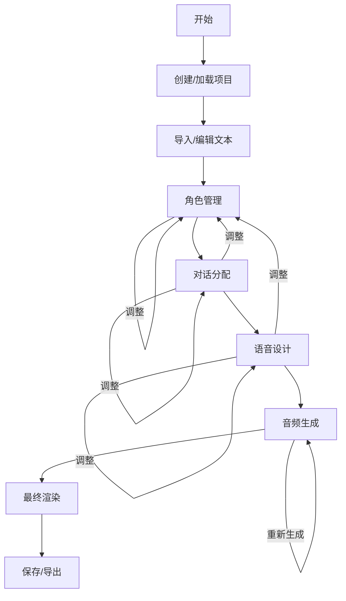

# ABM前端UX设计方案

## 1. 项目概述与目标用户

**项目定位**：ABM（Audio Book Maker）是一个智能有声书制作工具，通过LLM自动分析文本、提取角色、分配对话，并使用TTS技术生成高质量语音。

**目标用户**：
- 内容创作者（有声书制作人、播客制作者）
- 教育工作者（制作教学音频材料）
- 个人用户（将喜欢的文本转为有声书）
- 视障辅助工具使用者

**核心需求**：
- 简化复杂的有声书制作流程
- 提供智能自动化功能（角色提取、对话分配）
- 支持手动调整和精细控制
- 保持项目状态的持久化和断点续作

## 2. 用户工作流程分析

### 2.1 主要工作流程


### 2.2 详细步骤说明

| 步骤 | 功能 | 用户操作 | 系统响应 |
|------|------|----------|----------|
| **项目初始化** | 创建新项目或加载已有项目 | 输入项目名称、选择文本文件或粘贴文本 | 创建项目目录，初始化数据结构 |
| **角色提取** | 自动从文本中提取人物角色 | 点击"提取角色"按钮 | 调用LLM分析文本，显示提取的角色列表 |
| **角色配置** | 设置角色属性 | 编辑角色描述、启用/禁用TTS、设置语音名称 | 更新角色数据，为TTS准备语音设计 |
| **对话分配** | 自动分配对话到角色 | 点击"分配对话"按钮 | 分析引语上下文，分配说话人，显示分配结果 |
| **手动调整** | 修正自动分配结果 | 点击对话选择角色或设为未知 | 更新对话标签，标记需要重新生成音频 |
| **语音设计** | 生成语音控制指令 | 为每个角色点击"生成语音设计" | 调用LLM生成TTS指令，创建参考音频 |
| **音频生成** | 生成所有音频片段 | 点击"开始生成"按钮 | 批量生成音频文件，显示进度和错误 |
| **最终渲染** | 拼接音频生成最终文件 | 点击"渲染最终音频" | 拼接所有片段，生成完整有声书 |
| **项目管理** | 保存/加载/导出 | 自动保存（30秒保存一次）或手动保存 | 保存项目状态到磁盘，支持断点续作 |

## 3. 界面设计方案

### 3.1 步骤1：项目初始化界面

**界面布局**：
```
+---------------------------------------------------+
|                 ABM - 音频书制作工具                |
|                  Audio Book Maker                  |
+---------------------------------------------------+
|                                                   |
|  📋 最近项目 (最近使用的项目)                      |
|  +---------------------------------------------+  |
|  |                                             |  |
|  | [ 🔍 搜索项目... ]                          |  |
|  |                                             |  |
|  | ┌─────────────────────────────────────────┐ |  |
|  | │ 小说示例项目                             │ |  |
|  | │ 创建时间：2026-02-28 14:30               │ |  |
|  | │ 文本长度：5,432字                       │ |  |
|  | │ 状态：角色提取完成                       │ |  |
|  | │                                         │ |  |
|  | │                  [ 继续编辑 ]            │ |  |
|  | └─────────────────────────────────────────┘ |  |
|  |                                             |  |
|  | ┌─────────────────────────────────────────┐ |  |
|  | │ 教程音频制作                             │ |  |
|  | │ 创建时间：2026-02-27 10:15               │ |  |
|  | │ 文本长度：2,150字                       │ |  |
|  | │ 状态：音频生成中                         │ |  |
|  | │                                         │ |  |
|  | │                  [ 继续编辑 ]            │ |  |
|  | └─────────────────────────────────────────┘ |  |
|  |                                             |  |
|  | ┌─────────────────────────────────────────┐ |  |
|  | │ 儿童故事书                               │ |  |
|  | │ 创建时间：2026-02-25 09:45               │ |  |
|  | │ 文本长度：3,780字                       │ |  |
|  | │ 状态：已完成                            │ |  |
|  | │                                         │ |  |
|  | │                  [ 查看详情 ]            │ |  |
|  | └─────────────────────────────────────────┘ |  |
|  |                                             |  |
|  |         [ 加载更多项目... ]                 |  |
|  |                                             |  |
|  |  [ 🆕 创建新项目 ]   [ 📁 浏览所有项目 ]     |  |
|  +---------------------------------------------+  |
|                                                   |
+---------------------------------------------------+
```

**创建新项目模态框（点击"创建新项目"后弹出）**：
```
+---------------------------------------------------+
|                 🆕 创建新项目                      |
+---------------------------------------------------+
|                                                   |
|  项目名称： [_____________________________]       |
|                                                   |
|  文本来源： ● 上传文本文件                         |
|            ○ 粘贴文本                            |
|                                                   |
|  [ 选择文件 ] 支持的格式：.txt, .doc, .docx       |
|                                                   |
|  或直接粘贴文本：                                 |
|  +---------------------------------------------+  |
|  |                                             |  |
|  |                                             |  |
|  |                                             |  |
|  +---------------------------------------------+  |
|  (0/10000字)                                     |
|                                                   |
|         [ 创建项目 ]      [ 取消 ]               |
+---------------------------------------------------+
```

**设计说明**：
1. **主界面**：
   - 顶部显示应用名称和Logo
   - 搜索框：支持按项目名称搜索
   - 项目卡片：每个项目显示名称、创建时间、文本长度、状态
   - 操作按钮：根据项目状态显示"继续编辑"、"查看详情"等
   - 底部操作栏："创建新项目"和"浏览所有项目"按钮

2. **创建新项目模态框**：
   - 弹出式窗口，不离开主界面
   - 必填字段：项目名称
   - 文本来源选择：文件上传（支持.txt/.doc/.docx）或直接粘贴
   - 字符数统计
   - 创建和取消按钮

**交互流程**：
1. 用户打开应用，直接看到最近项目列表
2. 点击项目卡片上的"继续编辑"按钮，直接进入对应项目的编辑界面
3. 点击"创建新项目"按钮，弹出创建模态框
4. 填写项目信息后点击"创建"，后台调用API创建项目
5. 创建成功后自动关闭模态框，新项目出现在最近项目列表顶部
6. 点击新项目卡片上的"继续编辑"进入角色管理界面

**API调用**：
- `GET /api/projects?limit=10` - 获取最近10个项目
- `POST /api/projects` - 创建新项目
- `GET /api/projects?search=关键词` - 搜索项目

### 3.2 步骤2：角色提取界面

**界面布局**：
```
+-----------------------------------------------------------------------+
|  项目：小说示例项目                     [保存] [返回项目列表]           |
+-----------------------------------------------------------------------+
|                                                                       |
|  步骤导航：[✓文本处理] ● 2.角色提取 ○ 3.对话分配 ○ 4.语音设计 ○ 5.音频生成 ○ 6.最终渲染 |
|                                                                       |
|  +---------------------------------+ +-------------------------------+ |
|  |         文本预览区               | |       角色提取面板             | |
|  |                                 | |                               | |
|  |  【文本内容标题】                | |  👥 人物角色                  | |
|  |                                 | |                               | |
|  |  +---------------------------+  | |  已提取 3 个人物角色：         | |
|  |  |                           |  | |                               | |
|  |  |  这是一个故事的开头...     |  | |  ┌─────────────────────────┐ | |
|  |  |  张三说道："你好，李四！"  |  | |  │ 张三                     │ | |
|  |  |  李四回答："你好，张三！"  |  | |  │ 主角，年轻男性，性格开朗 │ | |
|  |  |  王五在旁边观察着...       |  | |  │                         │ | |
|  |  |                           |  | |  │     [编辑] [删除]        │ | |
|  |  |                           |  | |  └─────────────────────────┘ | |
|  |  +---------------------------+  | |                               | |
|  |                                 | |  ┌─────────────────────────┐ | |
|  |  [▲ 上一页] [1/5] [下一页 ▼]   | |  │ 李四                     │ | |
|  |                                 | |  │ 配角，中年男性，沉稳内敛│ | |
|  |                                 | |  │                         │ | |
|  |                                 | |  │     [编辑] [删除]        │ | |
|  |                                 | |  └─────────────────────────┘ | |
|  +---------------------------------+ |                               | |
|                                      |  ┌─────────────────────────┐ | |
|                                      |  │ 王五                     │ | |
|                                      |  │ 配角，老年男性，神秘莫测│ | |
|                                      |  │                         │ | |
|                                      |  │     [编辑] [删除]        │ | |
|                                      |  └─────────────────────────┘ | |
|                                      |                               | |
|                                      |  [🔄 重新提取人物]           | |
|                                      |  [➕ 手动添加人物]           | |
|                                      |                               | |
|                                      |  [下一步：对话分配 →]         | |
|                                      +-------------------------------+ |
|                                                                       |
+-----------------------------------------------------------------------+
```

**设计说明**：
1. **顶部导航栏**：
   - 显示当前项目名称
   - 保存按钮（自动保存提示）
   - 返回项目列表按钮
s
2. **步骤导航条**：
   - 显示当前进度：1.文本处理 → 2.角色提取 → 3.对话分配 → 4.语音设计 → 5.音频生成 → 6.最终渲染
   - 当前步骤高亮显示（●），已完成步骤显示（✓），未完成步骤显示（○）
   - 点击步骤可快速跳转

3. **文本预览区（左侧）**：
   - 显示项目文本内容，可滚动查看
   - 分页显示（长文本时）
   - 文本中可高亮显示已识别的人物名字（如"张三"、"李四"、"王五"等）

4. **角色提取面板（右侧）**：
   - **标题区域**：显示"人物角色"图标和状态（已提取X个人物角色）
   - **角色卡片列表**：每个角色显示名字和AI生成的简短描述
   - **操作按钮**：每个角色卡片有"编辑"和"删除"按钮
   - **底部操作**：
     - "重新提取人物"按钮：重新调用LLM分析文本
     - "手动添加人物"按钮：弹出添加角色表单
     - "下一步"按钮：跳转到对话分配界面

**交互流程**：
1. 用户进入项目后，自动显示文本内容
2. 右侧面板显示"未提取人物"状态，只有一个"开始提取人物"按钮
3. 用户点击"开始提取人物"按钮，系统调用LLM API提取角色
4. 提取过程中显示加载动画和进度提示
5. 提取完成后，右侧面板显示提取的角色列表
6. 用户可以点击"编辑"修改角色描述，点击"删除"移除角色
7. 用户可以点击"重新提取人物"重新分析文本
8. 用户可以点击"手动添加人物"添加LLM未识别的角色
9. 点击"下一步"进入对话分配界面

**API调用**：
- `GET /api/projects/<project_id>/text/segments` - 获取文本片段
- `POST /api/projects/<project_id>/characters/extract` - 提取人物角色
- `GET /api/projects/<project_id>/characters` - 获取角色列表
- `POST /api/projects/<project_id>/characters` - 手动添加角色
- `PUT /api/projects/<project_id>/characters/<character_name>` - 更新角色信息
- `DELETE /api/projects/<project_id>/characters/<character_name>` - 删除角色

**错误处理**：
- 提取失败时显示错误提示，提供重试选项
- 网络中断时自动重试或提示用户检查连接

### 3.3 角色配置界面（步骤2的一部分）

**界面布局**（点击角色提取面板中的"编辑"按钮后弹出）：
```
+---------------------------------------------------+
|                ✏️ 编辑角色：张三                   |
+---------------------------------------------------+
|                                                   |
|  角色信息：                                        |
|                                                   |
|  人物名字： 张三 (不可修改)                        |
|                                                   |
|  人物描述：                                        |
|  +---------------------------------------------+  |
|  | 主角，年轻男性，性格开朗，热爱冒险。          |  |
|  | 在故事中担任主要推动者，经常主动发起对话。    |  |
|  |                                             |  |
|  |                                             |  |
|  +---------------------------------------------+  |
|  (可编辑，支持多行)                               |
|                                                   |
|  TTS设置：                                        |
|                                                   |
|  [✓] 为这个角色生成语音                           |
|      （启用后，角色的对话将使用TTS生成语音）        |
|                                                   |
|  语音名称： [voice_zhangsan]                     |
|      （用于语音设计的唯一标识）                     |
|                                                   |
|  [🔄 AI生成描述]  [🎤 测试语音]                  |
|                                                   |
|         [ 保存更改 ]      [ 取消 ]               |
+---------------------------------------------------+
```

**AI生成描述模态框**（点击"AI生成描述"按钮后弹出）：
```
+---------------------------------------------------+
|             🤖 AI生成人物描述                     |
+---------------------------------------------------+
|                                                   |
|  为角色"张三"生成更详细的人物描述：                |
|                                                   |
|  可选建议：                                        |
|  [___________________________]                    |
|  （例如："强调他的幽默感和领导能力"）              |
|                                                   |
|  [ 开始生成 ]                                     |
|                                                   |
|  +---------------------------------------------+  |
|  |                                             |  |
|  |  ⏳ AI正在分析文本并生成人物描述...          |  |
|  |                                             |  |
|  +---------------------------------------------+  |
|  （生成中显示进度条）                              |
|                                                   |
|  +---------------------------------------------+  |
|  | 张三是一个充满活力的年轻人，性格外向开朗，     |  |
|  | 总是带着乐观的态度面对挑战。他具有强烈的       |  |
|  | 好奇心，喜欢探索未知，在团队中经常担任        |  |
|  | 领导角色。他的声音应该明亮有力，语速稍快，     |  |
|  | 体现出年轻人的活力和热情。                    |  |
|  |                                             |  |
|  +---------------------------------------------+  |
|  （生成完成后显示结果）                            |
|                                                   |
|         [ 使用此描述 ]    [ 重新生成 ] [ 取消 ]    |
+---------------------------------------------------+
```

**设计说明**：
1. **悬浮窗标题**：显示"编辑角色：角色名"
2. **基本信息区域**：
   - 人物名字：显示为不可编辑字段（作为唯一标识）
   - 人物描述：多行文本框，可编辑，显示AI生成的角色描述
3. **TTS设置区域**：
   - 复选框："为这个角色生成语音"（对应`requires_tts`）
   - 语音名称输入框：（对应`voice_name`），默认生成建议值
4. **功能按钮**：
   - "AI生成描述"：调用LLM重新生成更详细的人物描述
   - "测试语音"：如果已生成语音设计，可以试听该角色的声音
5. **操作按钮**：
   - "保存更改"：保存修改后的角色信息
   - "取消"：关闭悬浮窗，不保存更改

**交互流程**：
1. 用户在角色提取面板点击某个角色卡片的"编辑"按钮
2. 弹出角色配置悬浮窗，显示当前角色信息
3. 用户可以：
   - 编辑人物描述文本
   - 启用/禁用TTS生成
   - 修改语音名称
   - 点击"AI生成描述"重新生成描述
   - 点击"测试语音"试听（如果已生成语音设计）
4. 点击"保存更改"调用API更新角色信息
5. 悬浮窗关闭，角色提取面板中的对应角色卡片更新

**API调用**：
- `GET /api/projects/<project_id>/characters/<character_name>` - 获取角色详细信息
- `PUT /api/projects/<project_id>/characters/<character_name>` - 更新角色信息
- `POST /api/projects/<project_id>/characters/<character_name>/generate-description` - AI生成角色描述

**设计考虑**：
1. **人物名字不可编辑**：保持数据一致性，避免引用问题
2. **AI生成描述**：提供一键优化角色描述的功能
3. **TTS设置联动**：当禁用TTS时，可以隐藏或禁用语音名称字段
4. **语音测试**：需要语音设计完成后才可用

### 3.4 步骤3：对话分配界面（含手动调整功能）

**界面布局**：
```
+-----------------------------------------------------------------------+
|  项目：小说示例项目                     [保存] [返回项目列表]           |
+-----------------------------------------------------------------------+
|                                                                       |
|  步骤导航：[✓文本处理] [✓角色提取] ● 3.对话分配 ○ 4.语音设计 ○ 5.音频生成 ○ 6.最终渲染 |
|                                                                       |
|  +-------------------------------------------------------------------+ |
|  |                     对话分配进度与操作                             | |
|  +-------------------------------------------------------------------+ |
|  |                                                                   | |
|  |  已分配 12/45 个引语                                              | |
|  |                                                                   | |
|  |  [🔄 重新分配所有对话]  [🔍 仅显示未分配]  [📊 导出分配结果]       | |
|  |                                                                   | |
|  +-------------------------------------------------------------------+ |
|                                                                       |
|  +-------------------------------------------------------------------+ |
|  |                        文本分配视图                                | |
|  |  +-------------------------------------------------------------+  | |
|  |  |  这是一个故事的开头...                                       |  | |
|  |  |  张三说道："你好，李四！"                                    |  | |
|  |  |  李四回答："你好，张三！"                                    |  | |
|  |  |  王五在旁边观察着他们的对话，心中暗自思量。                  |  | |
|  |  |  "我觉得这个计划不太可行。" 他说出了自己的想法。              |  | |
|  |  |                                                             |  | |
|  |  |  引语高亮显示，非引语内容为灰色                               |  | |
|  |  +-------------------------------------------------------------+  | |
|  |                                                                   | |
|  |  分配状态：                                                       | |
|  |  ✅ "你好，李四！" → 张三                                        |  | |
|  |  ✅ "你好，张三！" → 李四                                        |  | |
|  |  ⏳ "我觉得这个计划不太可行。" → 点击分配                         |  | |
|  |                                                                   | |
|  |  [▲ 上一页] [1/10] [下一页 ▼]                                   |  | |
|  |                                                                   | |
|  |                            [下一步：语音设计 →]                   |  | |
|  +-------------------------------------------------------------------+ |
|                                                                       |
+-----------------------------------------------------------------------+
```

**点击引语分配的气泡界面**（点击未分配引语或已分配引语时弹出）：
```
                        +------------------------+
                        |     分配说话人          |
                        | +--------------------+ |
                        | | ● 张三             | |
                        | | ○ 李四             | |
                        | | ○ 王五             | |
                        | | ○ 默认（旁白）      | |
                        | | ○ 未知             | |
                        | +--------------------+ |
                        +------------------------+
```

**设计说明**：
1. **顶部操作区域**：
   - 进度显示：显示"已分配 X/Y 个引语"，实时更新
   - 功能按钮：
     - "重新分配所有对话"：重新调用LLM分析所有对话
     - "仅显示未分配"：筛选只显示未分配的引语，聚焦需要处理的部分
     - "导出分配结果"：导出CSV格式的分配明细

2. **文本分配视图**：
   - **引语高亮**：所有引语（带引号的对话）用浅黄色背景高亮显示
   - **非引语灰色**：所有非对话文本用浅灰色显示，降低视觉突出度
   - **分配状态区域**：在文本区域下方显示当前页面的引语分配状态
     - ✅ 已分配的引语：显示"引语内容 → 分配的角色"
     - ⏳ 未分配的引语：显示"引语内容 → 点击分配"（可点击）

3. **点击分配交互**：
   - **未分配引语**：点击"点击分配"链接或直接点击高亮引语
   - **已分配引语**：点击已分配的引语可以进行重新分配
   - **气泡选择**：弹出紧凑的气泡菜单，显示所有可选说话人
   - **即时分配**：选择后立即分配，无需确认按钮

**气泡选择设计**：
1. **紧凑布局**：垂直列表，每个选项一行
2. **单选按钮**：使用单选按钮（●/○）表示选择状态
3. **即时响应**：选择后气泡自动关闭，分配立即生效
4. **选项包括**：
   - 所有已配置的角色
   - "默认（旁白）"选项
   - "未知"选项（保持未分配状态）
5. **当前选择**：已分配的引语点击时，气泡中当前选项会预先选中

**交互流程**：
1. 用户从角色提取界面点击"下一步"进入对话分配界面
2. 系统自动调用LLM API进行对话分配
3. 分配过程中显示加载动画和进度条
4. 分配完成后：
   - 顶部显示分配进度
   - 文本区域显示高亮的引语和灰色的非引语内容
   - 分配状态区域显示当前页的分配状态
5. 用户可以进行手动调整：
   - 点击未分配引语：弹出气泡，选择说话人后立即分配
   - 点击已分配引语：弹出气泡，显示当前分配，可选择其他说话人
   - 选择后分配立即生效，进度实时更新
6. 用户可以：
   - 点击"重新分配所有对话"重新分析
   - 点击"仅显示未分配"聚焦需要手动处理的引语
7. 完成分配后点击"下一步"进入语音设计界面

**API调用**：
- `POST /api/projects/<project_id>/dialogues/allocate` - 自动分配对话
- `GET /api/projects/<project_id>/dialogues` - 获取对话分配状态
- `PUT /api/projects/<project_id>/dialogues/<segment_index>` - 手动分配单个对话
- `GET /api/projects/<project_id>/dialogues/unassigned` - 获取未分配引语列表

**设计考虑**：
1. **简化交互**：气泡选择直接分配，无需确认，提高操作效率
2. **视觉层次**：引语高亮突出，非引语灰色淡化，让用户专注于对话分配
3. **聚焦问题**：提供"仅显示未分配"功能，帮助用户快速定位需要手动处理的部分
4. **即时反馈**：分配状态区域实时显示当前页的分配情况，选择后立即更新
5. **批量操作**："重新分配所有对话"提供一键重新分析功能
6. **状态可见性**：已分配和未分配引语清晰区分，便于用户了解整体进度

### 3.5 步骤4：语音设计界面

**界面布局**：
```
+-----------------------------------------------------------------------+
|  项目：小说示例项目                     [保存] [返回项目列表]           |
+-----------------------------------------------------------------------+
|                                                                       |
|  步骤导航：[✓文本处理] [✓角色提取] [✓对话分配] ● 4.语音设计 ○ 5.音频生成 ○ 6.最终渲染 |
|                                                                       |
|  +-------------------------------------------------------------------+ |
|  |                    语音设计进度与操作                              | |
|  +-------------------------------------------------------------------+ |
|  |                                                                   | |
|  |  已生成 2/3 个语音设计                                            | |
|  |  （为启用TTS的角色生成语音控制指令和参考音频）                     | |
|  |                                                                   | |
|  |  [🔊 生成所有语音设计]  [🎵 批量测试语音]  [📋 导出语音设计]     | |
|  |                                                                   | |
|  +-------------------------------------------------------------------+ |
|                                                                       |
|  +-------------------------------------------------------------------+ |
|  |                      语音设计列表                                  | |
|  |  +-------------------------------------------------------------+  | |
|  |  |  ┌──────────────────────────────────────────────────────┐   |  | |
|  |  |  │  👤 张三 (voice_zhangsan)                             │   |  | |
|  |  |  │                                                      │   |  | |
|  |  |  │  TTS指令：年轻男性，声音明亮有力，富有活力...         │   |  | |
|  |  |  │                                                      │   |  | |
|  |  |  │  参考音频：✅ 已生成 [▶ 播放]                        │   |  | |
|  |  |  │                                                      │   |  | |
|  |  |  │                                  [✏️ 编辑]           │   |  | |
|  |  |  └──────────────────────────────────────────────────────┘   |  | |
|  |  |                                                             |  | |
|  |  |  ┌──────────────────────────────────────────────────────┐   |  | |
|  |  |  │  👤 李四 (voice_lisi)                                 │   |  | |
|  |  |  │                                                      │   |  | |
|  |  |  │  TTS指令：中年男性，声音沉稳内敛，语速平缓...         │   |  | |
|  |  |  │                                                      │   |  | |
|  |  |  │  参考音频：✅ 已生成 [▶ 播放]                        │   |  | |
|  |  |  │                                                      │   |  | |
|  |  |  │                                  [✏️ 编辑]           │   |  | |
|  |  |  └──────────────────────────────────────────────────────┘   |  | |
|  |  |                                                             |  | |
|  |  |  ┌──────────────────────────────────────────────────────┐   |  | |
|  |  |  │  👤 王五 (voice_wangwu)                               │   |  | |
|  |  |  │                                                      │   |  | |
|  |  |  │  TTS指令：⏳ 未生成                                   │   |  | |
|  |  |  │                                                      │   |  | |
|  |  |  │  参考音频：❌ 需要先生成TTS指令                       │   |  | |
|  |  |  │                                                      │   |  | |
|  |  |  │                                  [✏️ 编辑]           │   |  | |
|  |  |  └──────────────────────────────────────────────────────┘   |  | |
|  |  +-------------------------------------------------------------+  | |
|  |                                                                   | |
|  |                            [下一步：音频生成 →]                   |  | |
|  +-------------------------------------------------------------------+ |
|                                                                       |
+-----------------------------------------------------------------------+
```

**编辑语音设计悬浮窗**（点击卡片上的"编辑"按钮后弹出）：
```
+---------------------------------------------------------------+
|                 ✏️ 编辑语音设计：张三                         |
+---------------------------------------------------------------+
|                                                               |
|  语音名称： voice_zhangsan                                    |
|  对应角色： 张三                                              |
|                                                               |
|  TTS指令：                                                    |
|  +---------------------------------------------------------+  |
|  | 音色：年轻男性，声音明亮有力，富有活力。                |  |
|  | 语调：积极向上，略带兴奋感，适合冒险故事。              |  |
|  | 语速：中等偏快，体现出年轻人的急躁和热情。              |  |
|  | 情感：充满好奇心和探索欲，语调起伏明显。                |  |
|  | 发音：清晰准确，略带青春期的清脆感。                    |  |
|  +---------------------------------------------------------+  |
|  (可编辑，支持多行)                                           |
|                                                               |
|  [🤖 AI优化指令]                                             |
|                                                               |
|  参考文本（北风和太阳的故事）：                              |
|  +---------------------------------------------------------+  |
|  | 北风和太阳正在争论谁更强大，这时一个旅人走了过来，身    |  |
|  | 上裹着一件厚厚的外套。他们约定，谁能先让旅人脱下外套，  |  |
|  | 谁就是更强的一方...                                      |  |
|  +---------------------------------------------------------+  |
|  (可编辑，用于生成参考音频)                                   |
|                                                               |
|  参考音频状态：✅ 已生成 [▶ 播放] [🔄 重新生成]              |
|                                                               |
|  测试语音： [生成并播放测试音频]                             |
|                                                               |
|         [ 保存更改 ]      [ 取消 ]                           |
+---------------------------------------------------------------+
```

**设计说明**：
1. **顶部进度区域**：
   - 显示语音设计进度："已生成 X/Y 个语音设计"
   - 批量操作按钮：
     - "生成所有语音设计"：为所有启用TTS的角色批量生成语音设计
     - "批量测试语音"：一次性测试所有已生成语音设计的角色
     - "导出语音设计"：导出所有语音设计配置

2. **语音设计卡片**：
   - **标题**：显示角色图标、角色名和语音名称
   - **TTS指令预览**：显示TTS指令的前1-2行，过长时显示"..."，提供概览
   - **参考音频状态**：
     - ✅ 已生成：显示"✅ 已生成 [▶ 播放]"（点击播放按钮直接播放）
     - ⏳ 未生成：显示"⏳ 未生成"
     - ❌ 依赖未满足：显示"❌ 需要先生成TTS指令"
   - **操作按钮**：只有一个"✏️ 编辑"按钮，点击后弹出编辑悬浮窗

3. **编辑语音设计悬浮窗**：
   - **TTS指令编辑区**：显示完整的TTS指令，可手动编辑
   - **AI优化按钮**："🤖 AI优化指令" - 基于当前指令进行优化
   - **参考文本编辑区**：显示默认的参考文本（北风和太阳的故事），可编辑
   - **参考音频控制**：显示生成状态和操作按钮
     - ✅ 已生成：[▶ 播放] [🔄 重新生成]
     - ⏳ 未生成：[🔄 生成参考音频]
   - **测试功能**："生成并播放测试音频" - 使用自定义文本测试语音
   - **保存操作**："保存更改"和"取消"按钮

**交互流程**：
1. 用户从对话分配界面点击"下一步"进入语音设计界面
2. 系统自动检查哪些角色需要语音设计（启用TTS的角色）
3. 界面显示所有需要语音设计的角色卡片
4. 用户可以：
   - 点击"生成所有语音设计"批量处理
   - 点击卡片上的"▶ 播放"按钮直接播放参考音频（如果已生成）
   - 点击"✏️ 编辑"按钮进入编辑悬浮窗
5. 在编辑悬浮窗中，用户可以：
   - 编辑TTS指令文本
   - 点击"AI优化指令"优化当前指令
   - 编辑参考文本
   - 播放或重新生成参考音频
   - 生成测试语音
   - 保存更改
6. 所有语音设计完成后，点击"下一步"进入音频生成界面

**API调用**：
- `POST /api/projects/<project_id>/voice/generate-designs` - 生成所有语音设计
- `GET /api/projects/<project_id>/voice/designs` - 获取语音设计列表
- `PUT /api/projects/<project_id>/voice/designs/<voice_name>/update` - 更新语音设计
- `POST /api/projects/<project_id>/voice/generate-reference-audio` - 生成参考音频
- `POST /api/projects/<project_id>/voice/test` - 测试语音

**设计考虑**：
1. **简洁展示**：卡片上只显示关键信息和主要操作，避免信息过载
2. **快速访问**：参考音频可直接播放，无需进入编辑界面
3. **功能整合**：所有编辑和高级功能集中在编辑悬浮窗中
4. **状态清晰**：明确显示TTS指令和参考音频的生成状态
5. **即时反馈**：提供播放和测试功能，让用户及时了解语音效果
6. **依赖关系**：参考音频生成依赖TTS指令，界面状态应反映这种依赖关系

**响应式设计**：
- TTS指令显示：卡片上显示前50-80个字符，过长时用"..."截断
- 完整内容在编辑悬浮窗中查看和编辑
- 移动端适配：卡片垂直排列，操作按钮适当放大

### 3.6 步骤5：音频生成界面

**界面布局**：
```
+-----------------------------------------------------------------------+
|  项目：小说示例项目                     [保存] [返回项目列表]           |
+-----------------------------------------------------------------------+
|                                                                       |
|  步骤导航：[✓文本处理] [✓角色提取] [✓对话分配] [✓语音设计] ● 5.音频生成 ○ 6.最终渲染 |
|                                                                       |
|  +-------------------------------------------------------------------+ |
|  |                    音频生成进度与操作                              | |
|  +-------------------------------------------------------------------+ |
|  |                                                                   | |
|  |  已生成 32/45 个音频片段                                          | |
|  |  （生成所有文本片段对应的音频文件）                                | |
|  |                                                                   | |
|  |  [▶ 开始生成]  [🔄 重新生成失败片段]  [🗑️ 清除所有音频]            | |
|  |  [📊 生成日志]  [🔍 仅显示未生成]                                 | |
|  |                                                                   | |
|  +-------------------------------------------------------------------+ |
|                                                                       |
|  +-------------------------------------------------------------------+ |
|  |                      音频片段列表                                  | |
|  |  +-------------------------------------------------------------+  | |
|  |  |  片段索引 | 内容摘要         | 角色/标签    | 状态           |  | |
|  |  |----------|------------------|-------------|----------------|  | |
|  |  |  0       | 这是一个故事的... | 默认（旁白） | ✅ 已生成       |  | |
|  |  |          |                  |             | [▶ 播放] [🔄]  |  | |
|  |  |----------|------------------|-------------|----------------|  | |
|  |  |  1       | "你好，李四！"   | 张三         | ✅ 已生成       |  | |
|  |  |          |                  |             | [▶ 播放] [🔄]  |  | |
|  |  |----------|------------------|-------------|----------------|  | |
|  |  |  2       | "你好，张三！"   | 李四         | ✅ 已生成       |  | |
|  |  |          |                  |             | [▶ 播放] [🔄]  |  | |
|  |  |----------|------------------|-------------|----------------|  | |
|  |  |  3       | \n（换行符）     | PLACEHOLDER  | ✅ 已生成       |  | |
|  |  |          |                  |             | [▶ 播放] [🔄]  |  | |
|  |  |----------|------------------|-------------|----------------|  | |
|  |  |  4       | "我觉得这个计... | ⚠️ 未分配     | ❌ 生成失败     |  | |
|  |  |          |                  |             | [🔄 重试]      |  | |
|  |  |----------|------------------|-------------|----------------|  | |
|  |  |  5       | 王五在旁边观察...| 默认（旁白） | ⏳ 未生成       |  | |
|  |  |          |                  |             | [▶ 生成]       |  | |
|  |  |----------|------------------|-------------|----------------|  | |
|  |  |  6       | 。（句号）       | PLACEHOLDER  | ⏳ 未生成       |  | |
|  |  |          |                  |             | [▶ 生成]       |  | |
|  |  +-------------------------------------------------------------+  | |
|  |                                                                   | |
|  |  每页显示： [10 ▼] 条  [▲ 上一页] [1/5] [下一页 ▼]               | |
|  |                                                                   | |
|  |  [📋 导出生成报告]  [🔧 批量操作]                                | |
|  |                                                                   | |
|  |                            [下一步：最终渲染 →]                   | |
|  +-------------------------------------------------------------------+ |
|                                                                       |
+-----------------------------------------------------------------------+
```

**生成进度悬浮窗**（点击"开始生成"或生成过程中显示）：
```
+---------------------------------------------------+
|            🔊 音频生成进度                        |
+---------------------------------------------------+
|                                                   |
|  正在生成音频片段...                              |
|                                                   |
|  进度： ███████████████░░░░░░░ 68% (32/45)       |
|                                                   |
|  当前处理：片段 33 - "然后他们一起离开了..."      |
|  角色：李四                                       |
|  状态：生成中...                                  |
|                                                   |
|  已生成：32个片段                                 |
|  失败：1个片段                                    |
|  剩余：12个片段                                   |
|                                                   |
|  +---------------------------------------------+  |
|  | 生成日志：                                   |  |
|  | ✓ 片段 0: 生成成功                          |  |
|  | ✓ 片段 1: 生成成功                          |  |
|  | ✗ 片段 4: 生成失败 - 角色未分配              |  |
|  | ⏳ 片段 33: 生成中...                        |  |
|  +---------------------------------------------+  |
|                                                   |
|  [ ███ 后台继续生成 ]  [ ❌ 停止生成 ]           |
|                                                   |
+---------------------------------------------------+
```

**批量操作菜单**（点击"批量操作"按钮后弹出）：
```
+---------------------------------------------------+
|                  🔧 批量操作                      |
+---------------------------------------------------+
|                                                   |
|  [ ] 选择所有片段                                |
|                                                   |
|  选中 0/45 个片段                                 |
|                                                   |
|  [▶ 生成选中片段]                                |
|  [🔄 重新生成选中片段]                           |
|  [🗑️ 删除选中片段的音频]                         |
|  [📥 导出选中音频]                               |
|                                                   |
|  按角色筛选： [所有角色 ▼]                        |
|  按状态筛选： [所有状态 ▼]                        |
|                                                   |
|  [ 应用批量操作 ]  [ 取消 ]                      |
+---------------------------------------------------+
```

**设计说明**：
1. **顶部进度区域**：
   - 显示整体进度："已生成 X/Y 个音频片段"
   - 主要操作按钮：
     - "▶ 开始生成"：开始或继续生成所有未生成的音频片段
     - "🔄 重新生成失败片段"：仅重新生成失败的片段
     - "🗑️ 清除所有音频"：删除所有已生成的音频文件（警告确认）
     - "📊 生成日志"：查看详细的生成日志和错误信息
     - "🔍 仅显示未生成"：筛选只显示未生成或失败的片段

2. **音频片段列表**：
   - **表格形式**：显示片段索引、内容摘要、角色/标签、状态和操作
   - **内容摘要**：显示片段内容的前20-30个字符，过长用"..."截断
   - **角色/标签列**：
     - 角色名：如"张三"、"李四"
     - "默认（旁白）"：用于DEFAULT_TAG
     - "PLACEHOLDER"：用于PLACEHOLDER_TAG（换行符、标点等）
     - "⚠️ 未分配"：QUOTE_TAG但未分配角色
   - **状态列**：
     - "✅ 已生成"：生成成功，显示[▶ 播放] [🔄]按钮
     - "⏳ 未生成"：尚未生成，显示[▶ 生成]按钮
     - "❌ 生成失败"：生成失败，显示[🔄 重试]按钮
     - "⏳ 生成中"：正在生成中（实时更新）
   - **操作按钮**：
     - ▶ 播放：播放已生成的音频
     - 🔄 重新生成：重新生成该片段的音频
     - ▶ 生成：生成未生成的片段

3. **生成进度悬浮窗**：
   - 点击"开始生成"时自动弹出，显示实时进度
   - 进度条：视觉化显示生成进度
   - 当前处理信息：显示正在处理的片段详情
   - 统计信息：已生成、失败、剩余数量
   - 生成日志：实时显示每个片段的生成状态
   - 操作按钮："后台继续生成"（最小化）、"停止生成"

4. **批量操作功能**：
   - 复选框选择：支持全选、按角色筛选、按状态筛选
   - 批量操作：生成选中、重新生成选中、删除选中、导出选中
   - 提高操作效率，特别是处理大量片段时

**交互流程**：
1. 用户从语音设计界面点击"下一步"进入音频生成界面
2. 系统自动加载已生成和未生成的音频片段状态
3. 界面显示整体进度和片段列表
4. 用户可以：
   - 点击"开始生成"批量生成所有未生成的片段
   - 点击单个片段的"生成"按钮生成特定片段
   - 点击已生成片段的"播放"按钮试听音频
   - 点击"重新生成"重新生成特定片段
   - 使用"批量操作"进行批量处理
5. 生成过程中：
   - 显示进度悬浮窗，实时更新状态
   - 片段列表中的状态实时更新
   - 用户可以最小化进度窗口到后台运行
6. 生成完成后：
   - 所有片段状态变为"✅ 已生成"
   - 进度显示"45/45 个音频片段"
   - 可以点击"下一步"进入最终渲染界面

**API调用**：
- `POST /api/projects/<project_id>/audio/generate` - 开始生成音频
- `GET /api/projects/<project_id>/audio/status/<task_id>` - 获取生成状态（用于进度显示）
- `GET /api/projects/<project_id>/audio/segments` - 获取音频片段列表
- `POST /api/projects/<project_id>/audio/segments/<segment_index>/regenerate` - 重新生成单个音频片段
- `GET /api/projects/<project_id>/audio/progress` - 获取音频生成进度
- `DELETE /api/projects/<project_id>/audio/segments/<segment_index>` - 删除单个音频片段
- `POST /api/projects/<project_id>/audio/batch` - 批量操作（生成、重新生成、删除）

**错误处理**：
- **生成失败**：片段状态显示"❌ 生成失败"，鼠标悬停显示错误详情
- **角色未分配**：QUOTE_TAG片段未分配角色时无法生成，需要返回对话分配界面
- **TTS配置问题**：角色需要TTS但未配置语音设计时无法生成
- **网络中断**：生成过程中断时保存已生成的进度，支持断点续传
- **文件权限**：音频文件写入失败时显示明确的错误信息

**设计考虑**：
1. **实时反馈**：生成过程中实时更新进度和状态，让用户了解当前进度
2. **灵活控制**：支持单个片段操作和批量操作，满足不同粒度需求
3. **错误可追溯**：提供详细的生成日志和错误信息，便于排查问题
4. **断点续作**：生成过程可中断和恢复，支持大规模音频生成
5. **状态清晰**：使用颜色编码和图标区分不同状态（✅ ⏳ ❌ ⚠️）
6. **性能优化**：长列表使用分页和虚拟滚动，避免界面卡顿

### 3.7 步骤6：最终渲染界面

**界面布局**：
```
+-----------------------------------------------------------------------+
|  项目：小说示例项目                     [保存] [返回项目列表]           |
+-----------------------------------------------------------------------+
|                                                                       |
|  步骤导航：[v文本处理] [✓角色提取] [✓对话分配] [✓语音设计] [✓音频生成] ● 6.最终渲染 |
|                                                                       |
|  +-------------------------------------------------------------------+ |
|  |                    最终渲染检查与操作                              | |
|  +-------------------------------------------------------------------+ |
|  |                                                                   | |
|  |  音频片段状态检查：                                                | |
|  |                                                                   | |
|  |  ✅ 所有音频片段已生成 (45/45)                                     | |
|  |  ✅ 音频文件完整性验证通过                                         | |
|  |  ✅ 音频时长计算完成：总计 25分18秒                                | |
|  |  ⚠️  发现3个空白音频片段（占位符）                                 | |
|  |                                                                   | |
|  |  [🔍 查看详细状态]  [📋 导出渲染报告]                              | |
|  |                                                                   | |
|  +-------------------------------------------------------------------+ |
|                                                                       |
|  +-------------------------------------------------------------------+ |
|  |                      最终音频配置                                  | |
|  |  +-------------------------------------------------------------+  | |
|  |  |  输出格式： ● WAV (无损) ○ MP3 (压缩)                        |  | |
|  |  |  采样率：   [44100 Hz ▼]                                    |  | |
|  |  |  比特率：   [320 kbps ▼] (MP3格式时)                         |  | |
|  |  |  音频质量： [高品质 ▼]                                       |  | |
|  |  |  音量归一化：[✓] 启用自动音量调整                            |  | |
|  |  |  淡入淡出： [✓] 片段间添加淡入淡出效果 (0.1秒)               |  | |
|  |  |  元数据：   [✓] 添加项目信息到音频文件                       |  | |
|  |  +-------------------------------------------------------------+  | |
|  |                                                                   | |
|  |  [🎵 预览最终音频]  (需要先渲染)                                 | |
|  |                                                                   | |
|  +-------------------------------------------------------------------+ |
|                                                                       |
|  +-------------------------------------------------------------------+ |
|  |                      渲染操作与结果                                | |
|  |  +-------------------------------------------------------------+  | |
|  |  |                                                             |  | |
|  |  |  [✨ 开始渲染最终音频]                                       |  | |
|  |  |                                                             |  | |
|  |  |  预计渲染时间：约 30秒                                       |  | |
|  |  |  输出文件：final_audio.wav (约 265 MB)                       |  | |
|  |  |                                                             |  | |
|  |  |  +-------------------------------------------------------+  | |
|  |  |  |  🎉 渲染完成！                                        |  | |
|  |  |  |                                                       |  | |
|  |  |  |  ✅ 最终音频文件已生成                                 |  | |
|  |  |  |  📁 文件路径：/workspace/projects/小说示例项目/final_audio.wav | |
|  |  |  |  ⏱️  总时长：25分18秒                                  |  | |
|  |  |  |  📊 文件大小：265.4 MB                                 |  | |
|  |  |  |  🎵 音频格式：WAV (44.1kHz, 16bit, 立体声)              |  | |
|  |  |  |                                                       |  | |
|  |  |  |          [▶ 播放最终音频]  [📥 下载音频文件]            |  | |
|  |  |  |          [📋 复制分享链接]  [🔄 重新渲染]                |  | |
|  |  |  +-------------------------------------------------------+  | |
|  |  |                                                             |  | |
|  |  +-------------------------------------------------------------+  | |
|  |                                                                   | |
|  |  [🏠 返回项目列表]  [📁 打开项目文件夹]  [🔄 重新开始]            | |
|  +-------------------------------------------------------------------+ |
|                                                                       |
+-----------------------------------------------------------------------+
```

**详细状态面板**（点击"查看详细状态"后弹出）：
```
+---------------------------------------------------+
|            🔍 音频片段详细状态                    |
+---------------------------------------------------+
|                                                   |
|  音频片段统计：                                   |
|  - 总片段数：45个                                 |
|  - 对话片段：28个 (62%)                           |
|  - 旁白片段：14个 (31%)                           |
|  - 空白片段：3个 (7%)                             |
|                                                   |
|  角色使用统计：                                   |
|  - 张三：12个片段 (总时长 4分32秒)                |
|  - 李四：10个片段 (总时长 3分45秒)                |
|  - 王五：6个片段 (总时长 2分18秒)                 |
|  - 默认（旁白）：14个片段 (总时长 8分12秒)        |
|  - PLACEHOLDER：3个片段 (总时长 1.5秒)           |
|                                                   |
|  音频质量检查：                                   |
|  ✅ 所有音频文件存在且可读                         |
|  ✅ 采样率一致 (44100 Hz)                         |
|  ✅ 声道数一致 (立体声)                           |
|  ⚠️  片段4音量较低 (建议重新生成)                 |
|  ✅ 无静音或异常片段                              |
|                                                   |
|  时间线预览：                                     |
|  0:00 ──────────▶ 25:18                          |
|  ┌─────┬─────┬─────┬─────┐                       |
|  │旁白 │张三 │李四 │空白 │ ...                   |
|  └─────┴─────┴─────┴─────┘                       |
|                                                   |
|  [ 关闭 ]                                         |
+---------------------------------------------------+
```

**渲染进度悬浮窗**（点击"开始渲染最终音频"后显示）：
```
+---------------------------------------------------+
|            ✨ 最终音频渲染进度                    |
+---------------------------------------------------+
|                                                   |
|  正在渲染最终音频文件...                          |
|                                                   |
|  进度： ██████████████████░░░░ 85%               |
|                                                   |
|  当前步骤：音频拼接                               |
|  已处理：38/45 个片段                             |
|  预计剩余时间：8秒                                |
|                                                   |
|  步骤详情：                                       |
|  ✓ 1. 检查音频片段完整性                          |
|  ✓ 2. 加载所有音频文件                            |
|  ✓ 3. 应用音量归一化                              |
|  ⏳ 4. 拼接音频片段                               |
|  ○ 5. 添加淡入淡出效果                            |
|  ○ 6. 写入最终文件                                |
|  ○ 7. 添加元数据                                  |
|                                                   |
|  [ ███ 后台继续渲染 ]  [ ❌ 取消渲染 ]           |
|                                                   |
+---------------------------------------------------+
```

**设计说明**：
1. **状态检查区域**：
   - **完整性检查**：验证所有音频片段是否已生成
   - **文件验证**：检查音频文件是否完整可读
   - **时长统计**：计算总音频时长
   - **特殊片段提示**：提示空白音频片段（占位符）数量
   - **操作按钮**："查看详细状态"、"导出渲染报告"

2. **最终音频配置区域**：
   - **输出格式**：WAV（无损）或MP3（压缩）选项
   - **音频参数**：采样率、比特率（MP3）、质量设置
   - **增强功能**：音量归一化、淡入淡出效果、元数据
   - **预览功能**："预览最终音频"按钮（渲染后可用）

3. **渲染操作与结果区域**：
   - **渲染前**：显示"开始渲染最终音频"按钮，预计时间和输出信息
   - **渲染中**：显示进度悬浮窗，显示详细步骤
   - **渲染完成**：显示成功面板，包含：
     - 成功消息和完成图标
     - 文件路径、总时长、文件大小、音频格式
     - 操作按钮：播放、下载、复制分享链接、重新渲染
   - **底部导航**：返回项目列表、打开项目文件夹、重新开始

4. **详细状态面板**：
   - **统计信息**：片段类型分布、角色使用情况、时长统计
   - **质量检查**：音频文件完整性、一致性检查、问题提示
   - **时间线预览**：可视化显示音频片段的时间线分布

**交互流程**：
1. 用户从音频生成界面点击"下一步"进入最终渲染界面
2. 系统自动进行音频片段状态检查
3. 界面显示检查结果和配置选项
4. 用户可以：
   - 点击"查看详细状态"查看详细统计和质量报告
   - 调整最终音频的输出配置
   - 点击"开始渲染最终音频"开始渲染
5. 渲染过程中：
   - 显示进度悬浮窗，显示当前步骤和进度
   - 可以最小化到后台运行
6. 渲染完成后：
   - 显示成功面板，提供播放、下载等操作
   - 用户可以播放最终音频试听效果
   - 可以下载音频文件或复制分享链接
7. 完成后可以选择：
   - 返回项目列表开始新项目
   - 打开项目文件夹查看所有文件
   - 重新开始（返回步骤1）

**API调用**：
- `POST /api/projects/<project_id>/output/render` - 渲染最终音频
- `GET /api/projects/<project_id>/output/status` - 获取输出状态
- `GET /api/projects/<project_id>/output/download` - 下载最终音频文件
- `GET /api/projects/<project_id>/output/metadata` - 获取项目元数据
- `PUT /api/projects/<project_id>/output/metadata/update` - 更新项目元数据
- `GET /api/projects/<project_id>/audio/validation` - 音频验证检查

**设计考虑**：
1. **完整性验证**：渲染前进行全面检查，避免因缺失片段导致渲染失败
2. **配置灵活性**：提供多种输出格式和音频参数，满足不同需求
3. **过程透明**：渲染过程分步骤显示，让用户了解当前状态
4. **结果展示**：渲染成功后提供完整的文件信息和多种操作选项
5. **质量控制**：提供详细的音频质量检查和统计报告
6. **用户体验**：从创建到完成的完整闭环，提供清晰的结束状态和下一步选择

**错误处理**：
- **缺失片段**：如果还有未生成的音频片段，禁用渲染按钮并显示提示
- **文件损坏**：音频文件损坏时提示重新生成相关片段
- **格式不兼容**：音频参数不兼容时提供转换建议
- **磁盘空间不足**：检查输出目录的可用空间，空间不足时警告
- **渲染失败**：提供详细的错误信息和解决方案建议

### 3.8 项目管理界面（补充）

**虽然用户没有明确要求，但作为完整UX设计，建议添加项目管理界面**：

**项目详情界面**（从项目列表点击项目进入）：
```
+-----------------------------------------------------------------------+
|  项目：小说示例项目                     [编辑] [删除] [导出]            |
+-----------------------------------------------------------------------+
|                                                                       |
|  +-------------------------------------------------------------------+ |
|  |                      项目概览                                      | |
|  +-------------------------------------------------------------------+ |
|  |                                                                   | |
|  |  📅 创建时间：2026-02-28 14:30                                    | |
|  |  📅 最后修改：2026-02-28 16:45                                    | |
|  |  📄 文本长度：5,432字                                            | |
|  |  🎵 音频时长：25分18秒                                           | |
|  |  📁 文件大小：285.6 MB                                           | |
|  |  👥 角色数量：4个                                                | |
|  |  💬 对话数量：28个                                               | |
|  |  🎭 语音设计：3个                                                | |
|  |                                                                   | |
|  |  项目状态：✅ 已完成                                              | |
|  |  当前进度：● 最终渲染完成                                         | |
|  |                                                                   | |
|  +-------------------------------------------------------------------+ |
|                                                                       |
|  +-------------------------------------------------------------------+ |
|  |                      快速操作                                      | |
|  +-------------------------------------------------------------------+ |
|  |                                                                   | |
|  |  [▶ 播放最终音频]  [📥 下载音频]  [📋 复制分享链接]              | |
|  |  [🔧 重新生成音频]  [🔄 重新开始]  [⚙️ 项目设置]                 | |
|  |                                                                   | |
|  +-------------------------------------------------------------------+ |
|                                                                       |
|  +-------------------------------------------------------------------+ |
|  |                      项目时间线                                    | |
|  +-------------------------------------------------------------------+ |
|  |                                                                   | |
|  |  2026-02-28 14:30 ● 项目创建                                      | |
|  |  2026-02-28 14:35 ✓ 文本导入 (5,432字)                           | |
|  |  2026-02-28 14:42 ✓ 角色提取 (4个角色)                           | |
|  |  2026-02-28 14:55 ✓ 对话分配 (28个对话)                          | |
|  |  2026-02-28 15:10 ✓ 语音设计 (3个语音)                           | |
|  |  2026-02-28 15:45 ✓ 音频生成 (45个片段)                          | |
|  |  2026-02-28 15:50 ● 最终渲染完成                                 | |
|  |                                                                   | |
|  +-------------------------------------------------------------------+ |
|                                                                       |
|  [🏠 返回项目列表]  [📁 打开项目文件夹]  [🔄 继续编辑]                |
+-----------------------------------------------------------------------+
```

**项目设置界面**（点击"项目设置"后弹出）：
```
+---------------------------------------------------+
|                ⚙️ 项目设置                        |
+---------------------------------------------------+
|                                                   |
|  基本信息：                                       |
|  项目名称： [小说示例项目]                        |
|  项目描述： [这是一个示例小说的有声书制作项目...]  |
|                                                   |
|  文本处理设置：                                   |
|  分割格式： [按行分割 ▼]                          |
|  引号检测： [自动检测中文英文引号 ▼]              |
|  上下文窗口： [10] 行                             |
|                                                   |
|  音频生成设置：                                   |
|  默认停顿时长： [0.2] 秒                          |
|  换行停顿时长： [0.5] 秒                          |
|  句末停顿时长： [0.3] 秒                          |
|                                                   |
|  TTS模型设置：                                    |
|  设计模型路径： [/workspace/design_model]         |
|  克隆模型路径： [/workspace/clone_model]          |
|  使用Flash Attention：[✓] 启用                    |
|                                                   |
|  高级设置：                                       |
|  自动保存间隔： [30] 秒                           |
|  最大重试次数： [3] 次                            |
|  工作线程数： [4] 个                              |
|                                                   |
|         [ 保存设置 ]      [ 恢复默认 ] [ 取消 ]   |
+---------------------------------------------------+
```
