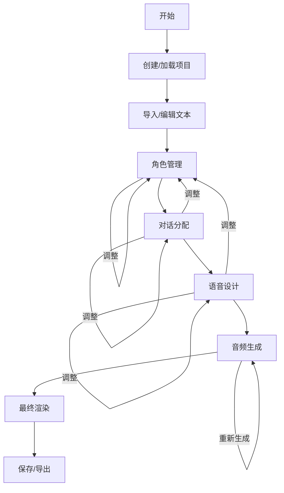

# ABM前端UX设计方案

## 1. 项目概述与目标用户

**项目定位**：ABM（Audio Book Maker）是一个智能有声书制作工具，通过LLM自动分析文本、提取角色、分配对话，并使用TTS技术生成高质量语音。

**目标用户**：
- 内容创作者（有声书制作人、播客制作者）
- 教育工作者（制作教学音频材料）
- 个人用户（将喜欢的文本转为有声书）
- 视障辅助工具使用者

**核心需求**：
- 简化复杂的有声书制作流程
- 提供智能自动化功能（角色提取、对话分配）
- 支持手动调整和精细控制
- 保持项目状态的持久化和断点续作

## 2. 用户工作流程分析

### 2.1 主要工作流程


### 2.2 详细步骤说明

| 步骤 | 功能 | 用户操作 | 系统响应 |
|------|------|----------|----------|
| **1. 项目初始化** | 创建新项目或加载已有项目 | 输入项目名称、选择文本文件或粘贴文本 | 创建项目目录，初始化数据结构 |
| **2. 角色提取** | 自动从文本中提取人物角色 | 点击"提取角色"按钮 | 调用LLM分析文本，显示提取的角色列表 |
| **3. 角色配置** | 设置角色属性 | 编辑角色描述、启用/禁用TTS、设置语音名称 | 更新角色数据，为TTS准备语音设计 |
| **4. 对话分配** | 自动分配对话到角色 | 点击"分配对话"按钮 | 分析引语上下文，分配说话人，显示分配结果 |
| **5. 手动调整** | 修正自动分配结果 | 点击对话选择角色或设为未知 | 更新对话标签，标记需要重新生成音频 |
| **6. 语音设计** | 生成语音控制指令 | 为每个角色点击"生成语音设计" | 调用LLM生成TTS指令，创建参考音频 |
| **7. 音频生成** | 生成所有音频片段 | 点击"开始生成"按钮 | 批量生成音频文件，显示进度和错误 |
| **8. 最终渲染** | 拼接音频生成最终文件 | 点击"渲染最终音频" | 拼接所有片段，生成完整有声书 |
| **9. 项目管理** | 保存/加载/导出 | 自动保存或手动保存 | 保存项目状态到磁盘，支持断点续作 |

## 3. 信息架构

### 3.1 主要功能模块
```
ABM前端应用
├── 项目管理模块
│   ├── 新建项目
│   ├── 打开项目
│   ├── 项目设置
│   └── 保存/导出
├── 文本处理模块
│   ├── 文本导入（文件/粘贴）
│   ├── 文本编辑
│   ├── 分割格式设置
│   └── 引语检测设置
├── 角色管理模块
│   ├── 角色列表视图
│   ├── 角色详情编辑
│   ├── 自动提取功能
│   └── TTS配置
├── 对话分配模块
│   ├── 文本分段视图
│   ├── 对话高亮显示
│   ├── 自动分配功能
│   └── 手动分配界面
├── 语音设计模块
│   ├── 语音指令编辑器
│   ├── 参考音频生成
│   ├── 音频预览播放器
│   └── 语音测试功能
├── 音频生成模块
│   ├── 生成进度监控
│   ├── 错误处理界面
│   ├── 音频片段列表
│   └── 重新生成控制
└── 最终输出模块
    ├── 最终音频播放器
    ├── 导出选项
    └── 元数据编辑
```

### 3.2 导航结构
```
主导航（顶部）
├── 项目
│   ├── 新建
│   ├── 打开
│   ├── 保存
│   └── 设置
├── 编辑
│   ├── 撤销
│   ├── 重做
│   └── 查找
└── 视图
    ├── 角色面板
    ├── 对话面板
    └── 音频面板

步骤导航（左侧）
1. 文本导入
2. 角色管理
3. 对话分配
4. 语音设计
5. 音频生成
6. 最终输出
```

## 4. 界面设计

### 4.1 整体布局
```
┌─────────────────────────────────────────────────────────────────────────┐
│ 顶部导航栏                                                                 │
│ [项目] [编辑] [视图] [帮助]                              [用户] [设置]        │
├─────────────────────────────────────────────────────────────────────────┤
│ 左侧步骤导航                        │ 主工作区                              │
│ ┌─────────────────┐               │ ┌─────────────────────────────────┐ │
│ │ 1. 文本导入     │               │ │                                 │ │
│ │ 2. 角色管理     │               │ │   当前步骤的内容区域              │ │
│ │ 3. 对话分配     │               │ │   根据步骤显示不同界面组件        │ │
│ │ 4. 语音设计     │               │ │                                 │ │
│ │ 5. 音频生成     │               │ │                                 │ │
│ │ 6. 最终输出     │               │ │                                 │ │
│ └─────────────────┘               │ └─────────────────────────────────┘ │
│                                   │                                     │
│ 右侧状态面板                      │ 底部状态栏                           │
│ ┌─────────────────┐               │ ┌─────────────────────────────────┐ │
│ │ 项目状态        │               │ │ 就绪 | 角色数: 5 | 对话数: 23    │ │
│ │ - 角色数: 5     │               │ │ 最后保存: 2分钟前                │ │
│ │ - 对话已分配: 18│               │ └─────────────────────────────────┘ │
│ │ - 音频生成: 65% │               │                                     │
│ └─────────────────┘               │                                     │
└─────────────────────────────────────────────────────────────────────────┘
```

### 4.2 关键界面组件设计

#### 4.2.1 文本导入界面
```
┌─────────────────────────────────────────────────────────────────────────┐
│ 文本导入                                                                  │
├─────────────────────────────────────────────────────────────────────────┤
│ 导入方式: ○ 粘贴文本   ○ 上传文件   ○ 从URL导入                           │
│                                                                         │
│ ┌─────────────────────────────────────────────────────────────────────┐ │
│ │ [在此粘贴文本内容...]                                                │ │
│ │                                                                     │ │
│ │                                                                     │ │
│ │                                                                     │ │
│ │                                                                     │ │
│ └─────────────────────────────────────────────────────────────────────┘ │
│                                                                         │
│ 文本统计: 字数: 0 | 段落: 0 | 预估时长: 0分钟                           │
│                                                                         │
│ 分割设置:                                                               │
│   ○ 按行分割（推荐用于对话文本）                                         │
│   ○ 按句子分割（推荐用于叙述文本）                                       │
│                                                                         │
│ 引语检测:                                                               │
│   ○ 自动检测（中英文混合）                                               │
│   ○ 仅中文引号                                                         │
│   ○ 仅英文引号                                                         │
│                                                                         │
│                               [下一步: 角色管理]                         │
└─────────────────────────────────────────────────────────────────────────┘
```

#### 4.2.2 角色管理界面
```
┌─────────────────────────────────────────────────────────────────────────┐
│ 角色管理                                                                  │
├─────────────────────────────────────────────────────────────────────────┤
│                              [自动提取角色]  [添加角色]                    │
│                                                                         │
│ ┌───────────────────┐ ┌───────────────────┐ ┌───────────────────┐     │
│ │ 张三              │ │ 李四              │ │ 王五              │     │
│ │ 主角，勇敢的青年  │ │ 反派，阴险的商人  │ │ 配角，忠诚的朋友  │     │
│ │                   │ │                   │ │                   │     │
│ │ TTS: ● 启用       │ │ TTS: ● 启用       │ │ TTS: ○ 禁用       │     │
│ │ 语音: voice_zhang│ │ 语音: voice_li    │ │ 语音: (无)        │     │
│ │                   │ │                   │ │                   │ │
│ │ [编辑] [删除]     │ │ [编辑] [删除]     │ │ [编辑] [删除]     │     │
│ └───────────────────┘ └───────────────────┘ └───────────────────┘     │
│                                                                         │
│ ┌─────────────────────────────────────────────────────────────────────┐ │
│ │ 角色详情编辑                                                          │ │
│ │ 名称: [张三                  ]                                        │ │
│ │ 描述: [勇敢的青年，正义感强，是故事的主角...]                          │ │
│ │                                                                     │ │
│ │ TTS设置: ● 启用语音合成  ○ 禁用                                        │ │
│ │ 语音名称: [voice_zhang       ] （用于TTS标识）                        │ │
│ │                                                                     │ │
│ │                             [保存] [取消]                             │ │
│ └─────────────────────────────────────────────────────────────────────┘ │
│                                                                         │
│                               [上一步] [下一步: 对话分配]                │
└─────────────────────────────────────────────────────────────────────────┘
```

#### 4.2.3 对话分配界面
```
┌─────────────────────────────────────────────────────────────────────────┐
│ 对话分配                                                                  │
├─────────────────────────────────────────────────────────────────────────┤
│                              [自动分配对话]  [手动模式]                    │
│ 上下文窗口大小: [10] 个片段                                               │
│                                                                         │
│ ┌─────────────────────────────────────────────────────────────────────┐ │
│ │ 文本分段视图                                                          │ │
│ │                                                                     │ │
│ │ 001 [默认] 从前有座山，山里有座庙。                                    │ │
│ │ 002 [张三] "师父，我什么时候才能下山？"                                 │ │
│ │ 003 [默认] 老和尚摸了摸胡须，缓缓说道：                                 │ │
│ │ 004 [未知] "等你悟透了这山中的道理。"                                  │ │
│ │ 005 [默认] 小和尚似懂非懂地点了点头。                                  │ │
│ │ 006 [换行]                                                            │ │
│ │ 007 [默认] 日子一天天过去...                                          │ │
│ │                                                                     │ │
│ │ 颜色标记:                                                             │ │
│ │   ● 默认旁白 ● 张三 ● 李四 ● 王五 ● 未知引语 ● 换行/标点                 │ │
│ └─────────────────────────────────────────────────────────────────────┘ │
│                                                                         │
│ 分配统计: 总引语: 23 | 已分配: 18 | 未分配: 5                            │
│                                                                         │
│ 批量操作:                                                               │
│   [将所有未知分配给:] [张三] [应用]                                      │
│   [将选中片段分配给:] [李四] [应用]                                      │
│                                                                         │
│                               [上一步] [下一步: 语音设计]                │
└─────────────────────────────────────────────────────────────────────────┘
```

#### 4.2.4 语音设计界面
```
┌─────────────────────────────────────────────────────────────────────────┐
│ 语音设计                                                                  │
├─────────────────────────────────────────────────────────────────────────┤
│ 角色选择: [张三 - voice_zhang] ▼                                         │
│                                                                         │
│ ┌─────────────────────────────────────────────────────────────────────┐ │
│ │ TTS控制指令                                                           │ │
│ │ [使用年轻男性的声音，语调坚定有力，语速中等偏快，带有一点侠客的豪迈气质。]│ │
│ │                                                                     │ │
│ │                              [重新生成指令]                           │ │
│ └─────────────────────────────────────────────────────────────────────┘ │
│                                                                         │
│ 参考音频生成:                                                           │
│   参考文本: [北风和太阳正在争论谁更强大...]                               │
│                              [生成参考音频] [播放] [重新生成]             │
│                                                                         │
│ 音频预览:                                                               │
│   ┌──────┬──────┬──────┬──────┬──────┬──────┬──────┬──────┐             │
│   │ 00:00│ 00:05│ 00:10│ 00:15│ 00:20│ 00:25│ 00:30│ 00:35│             │
│   └──────┴──────┴──────┴──────┴──────┴──────┴──────┴──────┘             │
│   [▶播放] [■停止] 音量: [●●●●○]                                          │
│                                                                         │
│ 测试语音: [输入测试文本...] [生成测试] [播放]                             │
│                                                                         │
│                               [上一步] [下一步: 音频生成]                │
└─────────────────────────────────────────────────────────────────────────┘
```

#### 4.2.5 音频生成界面
```
┌─────────────────────────────────────────────────────────────────────────┐
│ 音频生成                                                                  │
├─────────────────────────────────────────────────────────────────────────┤
│ 生成进度: 65% ███████████████████████░░░░░░░░░░░░░░░░░░░░░░░░░░░░░░       │
│ 已完成: 87/134 个片段                                                     │
│ 预计剩余时间: 15分钟                                                      │
│                                                                         │
│                              [暂停生成] [继续生成] [停止生成]              │
│                                                                         │
│ ┌─────────────────────────────────────────────────────────────────────┐ │
│ │ 音频片段列表                                                          │ │
│ │                                                                     │ │
│ │ 001 ✓ 00:05 [默认] 从前有座山...                                     │ │
│ │ 002 ✓ 00:08 [张三] "师父，我什么时候..."                               │ │
│ │ 003 ✓ 00:07 [默认] 老和尚摸了摸胡须...                                 │ │
│ │ 004 ✗ 00:00 [未知] (等待分配)                                         │ │
│ │ 005 ✓ 00:06 [默认] 小和尚似懂非懂...                                  │ │
│ │ 006 ✓ 00:02 [换行] (空白音频)                                         │ │
│ │ 007 ⚠ 00:00 [默认] 日子一天天过去... (生成失败)                        │ │
│ │ 008 ○ 00:00 [默认] (等待生成)                                         │ │
│ │                                                                     │ │
│ │ 图例: ✓ 成功 ⚠ 失败 ✗ 跳过 ○ 等待                                      │ │
│ └─────────────────────────────────────────────────────────────────────┘ │
│                                                                         │
│ 错误处理:                                                               │
│   片段 007 生成失败: TTS模型加载错误                                      │
│                             [重新生成选中] [忽略错误]                     │
│                                                                         │
│                               [上一步] [下一步: 最终输出]                │
└─────────────────────────────────────────────────────────────────────────┘
```

#### 4.2.6 最终输出界面
```
┌─────────────────────────────────────────────────────────────────────────┐
│ 最终输出                                                                  │
├─────────────────────────────────────────────────────────────────────────┤
│ 最终音频: 《山中小和尚》_final.wav (45分23秒)                              │
│                                                                         │
│ ┌─────────────────────────────────────────────────────────────────────┐ │
│ │ 音频播放器                                                            │ │
│ │                                                                     │ │
│ │ 00:12 / 45:23 ████████████░░░░░░░░░░░░░░░░░░░░░░░░░░░░░░░░░░░░░░░░░░ │ │
│ │                                                                     │ │
│ │ [⏮] [◀] [▶] [⏭] [■] 音量: [●●●●●]                                    │ │
│ └─────────────────────────────────────────────────────────────────────┘ │
│                                                                         │
│ 章节标记:                                                               │
│   00:00:00 开头                                                         │
│   00:05:23 第一章: 山中小庙                                              │
│   00:18:45 第二章: 下山之路                                              │
│   00:32:10 第三章: 江湖历练                                              │
│                                                                         │
│ 导出选项:                                                               │
│   ○ 单个WAV文件 ○ 分章节MP3 ○ M4B有声书格式                              │
│   音频质量: [高质量 (320kbps)] ▼                                         │
│   元数据: [编辑封面和标签...]                                            │
│                                                                         │
│                    [重新渲染] [导出音频] [保存项目]                       │
│                                                                         │
│                               [上一步] [完成]                            │
└─────────────────────────────────────────────────────────────────────────┘
```

## 5. 交互设计

### 5.1 关键交互模式

#### 5.1.1 拖放分配
```
在对话分配界面，用户可以将角色从左侧角色列表拖放到文本中的引语上：
   [张三] ────────┐
   [李四]         ▼
   [王五]   004 [未知] "等你悟透了这山中的道理。"
                 ▲
                 └─────── 拖放后变为 [张三] "等你悟透了这山中的道理。"
```

#### 5.1.2 批量操作
```
用户可以选择多个文本片段（Shift+点击或框选），然后使用右键菜单或工具栏进行批量操作：
   选中 002-004 片段 → 右键菜单 → "分配给 张三"
```

#### 5.1.3 实时预览
```
在语音设计界面，修改TTS指令后立即显示预览按钮，点击可快速生成短示例试听。
```

#### 5.1.4 上下文菜单
```
在文本视图的任何位置右键点击，显示上下文相关操作：
   - 分配给 [角色列表]
   - 标记为旁白
   - 标记为未知引语
   - 插入换行/标点
   - 播放音频（如果已生成）
```

### 5.2 状态反馈机制

#### 5.2.1 进度指示
- **全局进度**：顶部进度条显示整体工作流完成度
- **步骤进度**：每个步骤图标显示该步骤完成状态
- **操作进度**：长时间操作显示环形进度指示器

#### 5.2.2 成功/失败反馈
```typescript
// 成功操作
showToast("✅ 角色提取完成，共找到5个人物");

// 警告操作
showToast("⚠ 部分引语无法自动分配，请手动检查");

// 错误操作
showDialog("❌ 音频生成失败", "TTS模型加载错误，请检查模型路径配置");
```

#### 5.2.3 自动保存
- 每30秒自动保存项目
- 用户离开页面时提示保存
- 崩溃恢复：重新打开时提示恢复未保存工作

## 6. 技术栈建议

### 6.1 前端技术选型
```
推荐方案：React Web应用 + Flask Python后端API 
```

### 6.2 后端API设计
```python
# RESTful API 端点设计
API_BASE = /api

# 项目管理
GET    /projects              # 获取项目列表
POST   /projects              # 创建新项目
GET    /projects/{id}         # 获取项目详情
PUT    /projects/{id}         # 更新项目
DELETE /projects/{id}         # 删除项目

# 文本处理
POST   /projects/{id}/process-text  # 处理文本
PUT    /projects/{id}/text          # 更新文本

# 角色管理
GET    /projects/{id}/characters    # 获取角色列表
POST   /projects/{id}/characters    # 添加角色
PUT    /projects/{id}/characters/{char_id}  # 更新角色
DELETE /projects/{id}/characters/{char_id}  # 删除角色
POST   /projects/{id}/extract-characters    # 自动提取角色

# 对话分配
GET    /projects/{id}/dialogues             # 获取对话分配
POST   /projects/{id}/allocate-dialogues    # 自动分配对话
PUT    /projects/{id}/dialogues/{seg_id}    # 更新单个对话分配

# 语音设计
GET    /projects/{id}/voice-designs         # 获取语音设计
POST   /projects/{id}/generate-voice-design # 生成语音设计
POST   /projects/{id}/generate-reference-audio # 生成参考音频

# 音频生成
POST   /projects/{id}/generate-audio        # 开始生成音频
GET    /projects/{id}/audio-generation-status # 获取生成状态
GET    /projects/{id}/audio-segments        # 获取音频片段列表

# 最终输出
POST   /projects/{id}/render-audio          # 渲染最终音频
GET    /projects/{id}/final-audio           # 下载最终音频
```

### 6.3 实时通信需求
- **音频生成进度**：WebSocket推送进度更新
- **实时预览**：音频片段生成后立即通知前端
- **协同编辑**：未来可支持多用户协同（可选）


## 总结

ABM前端UX设计采用**向导式工作流**与**自由编辑模式**相结合的设计哲学，既引导新手用户完成完整的有声书制作流程，又为高级用户提供灵活的调整和控制能力。

**核心设计原则**：
1. **渐进式披露**：复杂功能按需展示，避免界面拥挤
2. **实时反馈**：操作后立即显示结果，增强用户信心
3. **容错设计**：允许撤销、重做和部分失败继续
4. **性能感知**：长时间操作提供进度反馈和预估时间
5. **一致性**：统一的视觉语言和交互模式贯穿所有界面

此设计方案为ABM提供了一个现代化、易用且功能强大的用户界面基础，既满足了当前核心功能需求，也为未来扩展留下了充足空间。
